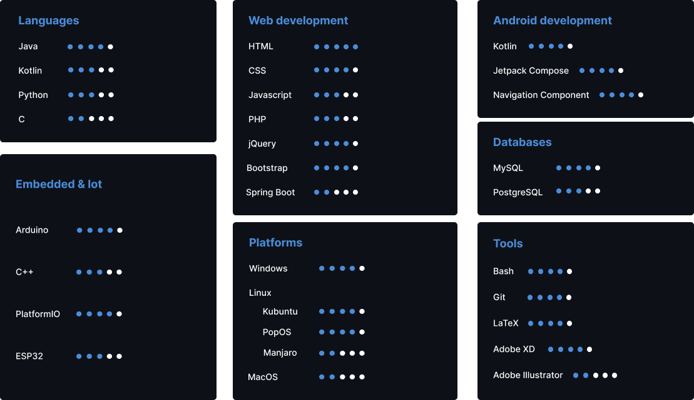

## whoami
My full name is *Andrea Severi*, but my bash says:
```bash
$ whoami
mitch; software engineer; currently studying at uniBO
```

- 🔭 I’m currently working on [Java More](https://github.com/seve-andre/java-more)


- 🌱 I’m currently learning Tensorflow and OpenCV


- ⚡ Fun fact: I don't use Vim. I'm not crazy

## Get in touch with me
<div>
<a href="https://www.instagram.com/seve_andre/" target="_blank">
    
</a>
&nbsp; <!--- hspace -->
<a href="https://www.linkedin.com/in/andrea-severi/" target="_blank">
    
</a>
&nbsp; <!--- hspace -->
<a href="https://mail.google.com/mail/u/0/?tab=mm#inbox?compose=CllgCJvpbJhNfMfzbCjhjFgFjFVzQvTdNMbtzlsvsftGGbFDMrjdmgcMmgVjPhhZBcRKwQnnCHg" target="_blank">
    
</a>
</div>

## Github Stats
<div>
  
  
</div>

## My Skill Set
### What I learned so far
Each skill has a score (out of 5).

**Score**:
- **1**: very basic knowledge
- **2**: little knowledge
- **3**: solid knowledge
- **4**: advanced knowledge
- **5**: master knowledge




### What I wanna learn
- Javascript frameworks (Angular, React, Vue.js, Node.js)
- ethical hacking
- Scala programming language
- microservices: RabbitMQ, Kafka
- crypto programming (e.g. Solidity)

## :books: Programming books I've read
- [Effective Java 3rd edition](https://www.oreilly.com/library/view/effective-java/9780134686097/)
- [Head First Design Patterns 2nd edition](https://www.oreilly.com/library/view/head-first-design/9781492077992/)
